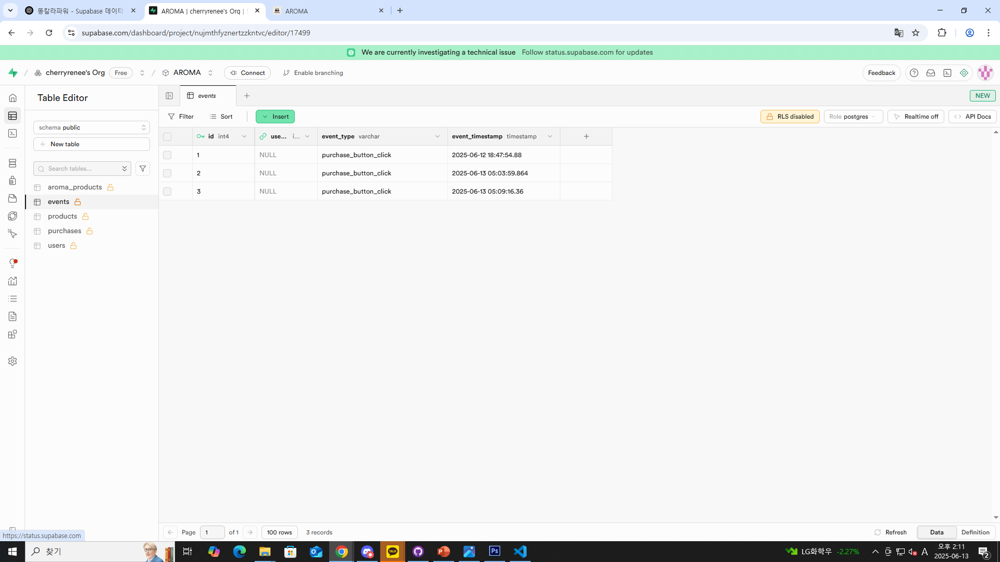
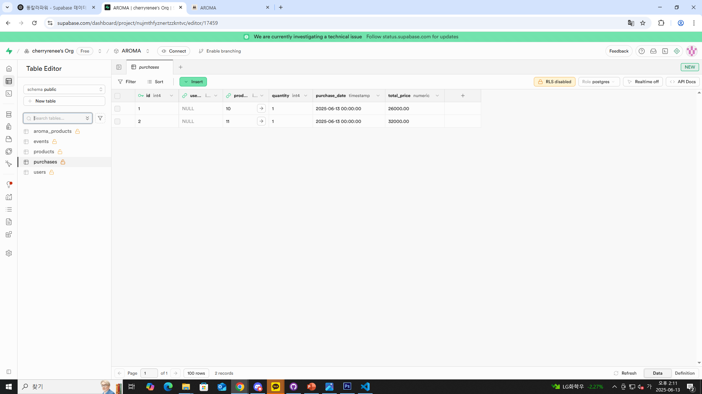
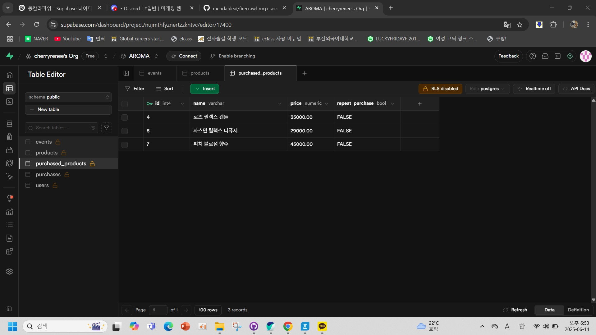

# My React Shop Project

이 프로젝트는 React, TypeScript, Supabase를 활용한 쇼핑몰 웹 애플리케이션입니다.  
장바구니, 결제, 주문 내역, 마이페이지 등 전형적인 이커머스 기능을 제공합니다.

---

## 주요 기능

- **장바구니**: 상품을 담고 수량을 조절할 수 있습니다.
- **결제**: 결제 동의 후 결제 버튼을 누르면 결제 완료 페이지로 이동합니다.
- **주문 내역**: 결제 완료 시 주문 내역이 저장되고, 마이페이지에서 확인할 수 있습니다.
- **마이페이지**: 주문/배송 건수, 포인트 등 회원 정보를 확인할 수 있습니다.
- **구매 데이터 수집**: 결제 시 구매 내역 및 구매 상품 데이터가 Supabase에 저장됩니다.

---

## 폴더 구조

```
src/
  components/
    MyPage/
      CurrentOrder.tsx      // 주문 내역(카드) 표시
      Identity.tsx          // 마이페이지 상단 정보
    Payment/
      PaymentButton.tsx     // 결제 버튼 및 결제 처리
      PaymentComplete.tsx   // 결제 완료 처리 및 데이터 저장
  context/
    OrderContext.tsx        // 주문 내역 상태 관리
    CartContext.tsx         // 장바구니 상태 관리
    AgreementContext.tsx    // 결제 동의 상태 관리
  utils/
    collectPurchaseData.ts  // 구매 데이터 수집 유틸 함수
  App.tsx
  AppRoutes.tsx
  index.tsx
  index.css
```

---

## 주요 파일 설명

### 1. `OrderContext.tsx`

- 주문 내역(`orderHistory`)을 `OrderRecord[]` 형태로 관리합니다.
- 주문 추가 시 `purchase_date`(주문일자)와 상품 목록을 함께 저장합니다.
- `useOrder()` 훅으로 주문 내역을 어디서든 사용할 수 있습니다.

### 2. `PaymentComplete.tsx`

- 결제 완료 시 `addOrder`로 주문 내역을 저장하고, 장바구니를 비웁니다.
- 구매 내역 및 구매 상품 데이터를 Supabase에 저장합니다.
  - 구매 내역: product_id, quantity, purchase_date, total_price
  - 구매 상품: id, title, price(숫자)

### 3. `collectPurchaseData.ts`

- 주문 내역에서 구매 데이터(product_id, quantity, purchase_date, total_price)를 추출하는 유틸 함수입니다.

### 4. `CurrentOrder.tsx`

- 마이페이지에서 주문 내역(카드 형태)로 주문 정보를 보여줍니다.

### 5. `Identity.tsx`

- 마이페이지 상단에서 회원 이름, 포인트, 주문/배송 건수 등을 표시합니다.

---

## Supabase 연동

- `supabaseClient.ts`에서 Supabase 인스턴스를 생성해 사용합니다.
- 결제 완료 시 구매 내역과 구매 상품 정보를 각각 테이블에 insert합니다.
- 테이블명과 컬럼명은 실제 Supabase DB 구조에 맞게 수정해야 합니다.

---


## 기타

- 폰트는 public/fonts 또는 CDN을 통해 적용할 수 있습니다.
- 모든 React Hook은 반드시 함수 컴포넌트 내부에서만 호출해야 합니다.
- Context Provider(`OrderProvider` 등)는 반드시 App 전체를 감싸도록 설정해야 합니다.

---

## 문의

이 프로젝트에 대한 문의는 이슈 또는 Pull Request로

---

## netlify 배포 주소

https://dapper-sunshine-5cee34.netlify.app/

---

## 데이터 수집 항목

- event: 결제버튼 누른 event, time_stamp 데이터. 구매 시간대를 분석하여 이에 맞는 시간 한정 이벤트 팝업 창을 띄우는 등의 마케팅 전략 기획 가능
- purchases: product_id, quantity, purchase_date, total_price 데이터. 구매 데이터를 분석하여 한 번에 결제하는 금액의 평균을 계산하여 새로운 제품의 가격을 측정할 수 있는 기준을 만들거나 할인 이벤트에서 할인 금액 산정 기준이 될 수 있음
- purchased_products: id(product_id), name, price 데이터. 가장 많이 구매된 제품을 알 수 있음. 또한 로그인 페이지를 활성화하여 user_id를 수집한다면 재구매율도 계산하여 이에 맞는 마케팅 수집이 가능함

---

## 데이터 수집 사진






